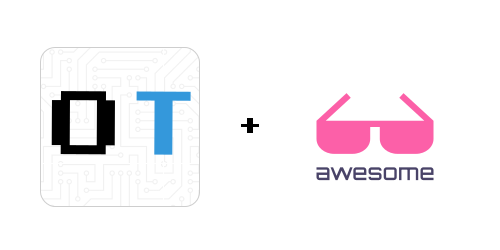

    
  
     
  
     
  <h2>
    <strong>OpenTech Awesome List</strong>
  </h2>
  

    Recopilación de links de guías, artículos, tutoriales, vídeos, charlas, conferencias, podcasts, cursos y libros sobre el mundo tecnológico.
  

    
  

    <i>
      ¿Quieres contribuir con algún recurso? ¡Excelente! Por favor, lea nuestra <a href="CONTRIBUTING.md">guía de contribución</a> antes de contribuir.
    </i>
  

    

## Emoji Keys

| Emoji | Título               |
| ----- | -------------------- |
| 🇪🇸    | Español              |
| 🇺🇸    | Inglés               |
| 💰    | Contenido de pago    |
| ✍️    | Contenido de texto   |
| 📹    | Contenido de video   |
| 🎙️    | Contenido de audio   |
| 🗣️    | Charla o Conferencia |
| 📖    | Libro                |
| 🎫    | Evento               |
| 🍎    | Curso                |
| 🛠️    | Tools                |
| 💼    | Portafolio           |
| 🐙    | Repositorio          |
| 👾    | Juego                |

## Tabla de Contenido 
---

🇪🇸📹 [EDteam: No seas un estudiante eterno](https://www.youtube.com/watch?v=ZsYnNYOH8WU)

🇪🇸🍎 [Elixir School: Aprendamos Elixir](https://elixirschool.com/es/)

🇪🇸✍️[🛠️ Las mejores aplicaciones y herramientas gratis para GNU/Linux](https://www.xataka.com/basics/mejores-aplicaciones-herramientas-gratis-2019-para-gnu-linux)

🇪🇸✍️ [Es hora de regresar a un mejor balance de hombres y mujeres en tecnología](https://hub.laboratoria.la/es-hora-de-regresar-a-un-mejor-balance-de-hombres-y-mujeres-en-tecnolog%C3%ADa?utm_source=LinkedIn&utm_medium=social&utm_campaign=mes-de-la-mujer-2020)

🇪🇸🗣️ [Como ser emocionalmente profesional | Crecer duele](https://youtu.be/lF4rqKyylvY)

🇪🇸✍️ [Como superar el sindrome del impostor.](https://platzi.com/blog/como-superar-sindrome-impostor/)

🇪🇸✍️ [En tecnología, tu profesión puede no ser lo más importante](https://medium.com/getonbrd/en-ti-tu-profesi%C3%B3n-puede-no-ser-lo-m%C3%A1s-importante-1b753f0d7e7d)

🇺🇸✍️ [New to JAMstack? Everything You Need to Know to Get Started - Mathieu Dionne](https://snipcart.com/blog/jamstack)

🇺🇸✍️[🤔 What the JAMstack means for marketing - Kym Ellis](https://kymellis.co/jamstack-marketing-headless-cms/)

🇺🇸✍️[🤔 Pick the Best Static Site Generator for your 2020 Projects - Mathieu Dionne](https://snipcart.com/blog/choose-best-static-site-generator)

🇺🇸✍️[🤔 How to design an ergonomic workspac - Szymon Michalak](https://x-team.com/blog/ergonomic-workspace)

🇺🇸[🎫 JAMStack Conference](https://jamstackconf.com/)

🇺🇸💰🛠️ [Tomato.to: Descargar las mejores imagenes exclusivas, de manera gratuita.](https://tomato.to/)

🇺🇸🛠️ [Galería de iconos Free en Github.](https://github.com/simple-icons/simple-icons)

🇺🇸🗣️ [Como los lideres inspiran a la acción](https://www.ted.com/talks/simon_sinek_how_great_leaders_inspire_action?language=es#t-2113)

🇺🇸✍️ [How to become a Fullstack Web Developer in 2020](https://www.freecodecamp.org/news/how-to-become-a-full-stack-web-developer-in-2020/)

🇺🇸🍎 [JAMStack: Introduction to the Jamstack](https://jamstack.training/p/introduction-to-the-jamstack)

🇺🇸🍎 [JAMStack: Create a Blog Using the Jamstack](https://jamstack.training/p/create-a-blog-using-the-jamstack)

🇺🇸🍎 [JAMStack: Create an E-Commerce App with Gatsby](https://jamstack.training/p/create-an-e-commerce-app-with-gatsby)

🇺🇸🍎 [JAMStack: Pre-Generate Static Pages With Dynamic Content](https://jamstack.training/p/pre-generate-static-pages-with-dynamic-content)

🇺🇸🍎 [JAMStack: Authentication in the Jamstack](https://jamstack.training/p/authentication-in-the-jamstack)

🇺🇸🍎 [JAMStack: Gatsby Cloud with CosmicJS](https://jamstack.training/p/using-gatsby-cloud)

🇺🇸🍎 [JAMStack: Jamstack and Serverless](https://jamstack.training/p/jamstack-and-serverless)

🇺🇸🍎 [JAMStack: Serverless Functions and Databases](https://jamstack.training/p/serverless-functions-and-databases)

🇺🇸🍎 [JAMStack: Gatsby Cloud with Contentful CMS](https://jamstack.training/p/gatsby-cloud-with-contentful-cms)

🇺🇸🍎 [JAMStack: Create a Jamstack app with Nuxt.js and Firebase](https://jamstack.training/p/create-a-jamstack-app-with-nuxt-js-and-firebase)

🇺🇸🛠️ [CodeMyUI: Web Design & UI Inspiration with Code Snippets](https://codemyui.com/)

🇺🇸🛠️ [Badgen: Fast badge generating service](https://badgen.net/)

🇺🇸🛠️ [Shields.io: Quality metadata badges for open source projects](http://shields.io/)

🇺🇸🛠️ [hackr.io: Find the Best Programming Courses & Tutorials](https://hackr.io/)

🇺🇸✍️ [Redux for React: A Simple Introduction](https://medium.com/@rossbulat/redux-for-react-a-simple-introduction-b1f9dcbda8f4)

🇺🇸✍️💼 [How to write a killer Softare Engineering résumé](https://medium.com/free-code-camp/writing-a-killer-software-engineering-resume-b11c91ef699d)

🇺🇸✍️ [How to stand out with your Github Profile](https://x-team.com/blog/stand-out-with-a-github-profile/)

🇺🇸✍️ [Todas la etiquetas HTML, de manera interactiva.](https://allthetags.com/)

🇺🇸✍️🍎 [700 Free Online Programming & Computer Science Courses](https://www.freecodecamp.org/news/free-online-programming-cs-courses/)

🇺🇸🍎 [CSS Reference: A free visual guide to CSS](https://cssreference.io)

🇺🇸📹 [How I learned to code - and got I job at google](https://www.youtube.com/watch?v=mElVGah7Epg&feature=youtu.be)

🇺🇸✍️ [Onboarding a junior developer to your team](https://dev.to/carolstran/onboarding-a-junior-developer-to-your-team-here-s-12-tips-4g3a)

🛠️🎫 [List hackaton code of the world](https://devpost.com/hackathons?challenge_type=online)

🇺🇸🎫 [Hack Nigth club](https://hackclub.com/night/)

🇺🇸🍎 [TryRuby: Learn programming with Ruby](https://try.ruby-lang.org/)

🇺🇸✍️ [10 Extraordinary GitHub Repos for All Developers](https://medium.com/better-programming/10-extraordinary-github-repos-for-all-developers-939cdeb28ad0)

🇺🇸🛠️ [unDraw: Open-source illustrations](https://undraw.co/)

🇺🇸🛠️ [Humaaans: Mix-&-Match illustration library](https://www.humaaans.com/)

🇺🇸🍎 [Codedamn: Learn to code online](https://codedamn.com/)

🇺🇸📖 [A Beginner's Guide to Getting Started in UX Research](https://www.notion.so/A-Beginner-s-Guide-to-Getting-Started-in-UX-Research-1e3e0567b4944c938ae8d1a4f0a21c56)

🇺🇸📖 [LaunchSchool: Introduction to Programming with Ruby](https://launchschool.com/books/ruby)

🇺🇸📖 [LaunchSchool: Introduction to the Command Line](https://launchschool.com/books/command_line)

🇺🇸📖 [LaunchSchool: A Guide to Git and Github](https://launchschool.com/books/git)

🇺🇸📖 [LaunchSchool: Object Oriented Programming with Ruby](https://launchschool.com/books/oo_ruby)

🇺🇸📖 [LaunchSchool: Core Ruby Tools](https://launchschool.com/books/core_ruby_tools)

🇺🇸📖 [LaunchSchool: Introduction to HTTP](https://launchschool.com/books/http)

🇺🇸📖 [LaunchSchool: Introduction to SQL](https://launchschool.com/books/sql)

🇺🇸📖 [LaunchSchool: Introduction to Regular Expressions](https://launchschool.com/books/regex)

🇺🇸📖 [LaunchSchool: Working with Web APIs](https://launchschool.com/books/working_with_apis)

🇺🇸📖 [LaunchSchool: Agile Planning: From Ideas to Story Cards](https://launchschool.com/books/agile_planning)

🇺🇸📖 [LaunchSchool: Demystifying Rails](https://launchschool.com/books/demystifying_rails)

🇺🇸📖 [LaunchSchool: Introduction to Programming with JavaScript](https://launchschool.com/books/javascript)

🇺🇸✍️🍎 [Free GitHub Learning Labs A to Z of Web Development](https://dev.to/krishnakakade/free-github-learning-labs-a-to-z-of-web-development-3501)

🇺🇸🍎 [Execute Program: TypeScript](https://www.executeprogram.com/courses/typescript)

🇺🇸🍎 [Execute Program: SQL](https://www.executeprogram.com/courses/sql)

🇺🇸🍎 [Execute Program: Regular Expressions](https://www.executeprogram.com/courses/regexes)

🇺🇸🍎 [Execute Program: Modern JavaScript](https://executeprogram.com/courses/modern-javascript)

🇺🇸🍎 [Execute Program: JavaScript Concurrency](https://www.executeprogram.com/courses/javascript-concurrency)

🇺🇸🍎 [Execute Program: JavaScript Arrays](https://www.executeprogram.com/courses/javascript-array)

🇺🇸📖 [FrontMasters: Front-end Developer Handbook 2019](https://frontendmasters.com/books/front-end-handbook/2019/)

🇪🇸📹 [PlatziConf: Ahorrar no te va a salvar del futuro](https://youtu.be/RXntdwpkogk?list=PLa28R7QEiMbkGahEPjXsCfkXm7AKnL-aj)

🇪🇸📹 [PlatziConf: Git, la base la colaboración más allá del código](https://youtu.be/jF26LIgrXok?list=PLa28R7QEiMbkGahEPjXsCfkXm7AKnL-aj)

🇺🇸🍎 [mlcourse: Open Machine Learning Course](https://mlcourse.ai/)

🇺🇸🍎 [React School: React Native](https://reactnative.dev/docs/getting-started)

🇺🇸🛠️✍️ [8 VSCode extensions you might love](https://medium.com/better-programming/8-vs-code-extensions-you-might-love-eba03d85fd4f)

🇺🇸✍️ [These four “clean code” tips will dramatically improve your engineering team’s productivity](https://engineering.videoblocks.com/these-four-clean-code-tips-will-dramatically-improve-your-engineering-teams-productivity-b5bd121dd150)

🇺🇸✍️💼 [10 Great Programming Projects to Improve Your Resume and Learn to Program](https://levelup.gitconnected.com/10-great-programming-projects-to-improve-your-resume-and-learn-to-program-74b14d3e9e16)

🇺🇸✍️ [65 UX methods and when to use them](https://uxdesign.cc/65-ux-methods-and-when-to-use-them-73e70c742d12)

🇺🇸🛠️ [Mentimeter: Create interactive presentations & meetings](https://www.mentimeter.com/)

🇺🇸🛠️ [H5P: Create and Compartir Rich HTML5 Content and Applications](https://h5p.org/)

🇪🇸🛠️ [Genially: La herramienta para crear contenidos interactivos que enamoran a tu audiencia.](https://www.genial.ly/)

🇺🇸🛠️💰 [Miro: Interactive board](https://miro.com/webwhiteboard/)

🇺🇸🍎 [MongoDB University](https://university.mongodb.com/)

🇺🇸✍️ [CodeSource: Build a simple E-Commerce App with React Native](https://codesource.io/e-commerce-app-with-react-native/)

🇺🇸✍️ [CodeSource: Build a CRUD Application with React and Apollo GraphQL](https://codesource.io/build-a-crud-application-with-react-and-apollo-graphql/)

🇺🇸✍️ [CodeSource: 7 Python coding practices every developer should know](https://codesource.io/python-coding-practices/)

🇺🇸🍎 [CodeSource: Learn Git, Github, and Opensource](https://codesource.io/learn-git-github-and-opensource-course/)

🇺🇸🍎 [CodeSource: Learn SOLID Principles of Object-Oriented Design](https://codesource.io/learn-solid-principles-of-object-oriented-design-course/)

🇺🇸💰🛠️ [Flock: makes communication and collaboration effortless](https://flock.com/?utm_expid=.mAvynC9KRiOegdKr-0ZsFg.0&utm_referrer=)

🇪🇸💰🛠️ [Todoist: Organízalo todo](https://todoist.com/es/home)

🇺🇸💰🛠️ [Citrix Podio: Get your teams working in sync](https://podio.com/site)

🇪🇸🛠️ [Trello: trabajar de forma más colaborativa y ser más productivo.](https://trello.com/)

🇪🇸💰🛠️ [Workep: La herramienta de colaboración remota entre empresas.](https://workep.com/es/es.html)

🇪🇸💰🛠️ [Atlassian: Herramienta de desarrollo de software.](https://www.atlassian.com/es/software/jira)

🇺🇸🛠️ [OBS Studio: Free and open source software for video recording and live streaming.](https://obsproject.com/)

🇺🇸🛠️ [AlternativeTo: Crowdsourced software recommendations](https://alternativeto.net/)

🇺🇸🛠️ [LastPass: Recuerda todas sus contraseñas de forma segura para que usted no tenga que hacerlo.](https://www.lastpass.com/es)

🇺🇸🛠️ [Boxy SVG Editor: Editing SVG files](https://boxy-svg.com/).

🇺🇸🛠️ [CloudConvert: The converter of all types of files, online](https://cloudconvert.com/)

🇺🇸🛠️ [PlayFilm: Genera más leads cualificados e incrementa tu conversión a venta con Video Quizzes.](https://playfilm.tv/)

🇪🇸💰🛠️ [WeVideo: El editor de vídeo en línea para todos.](https://www.wevideo.com/)

🇺🇸💰🛠️ [RawShorts: Transform Text into Animated Videos.](https://www.rawshorts.com/)

🇪🇸💰🛠️ [Powtoon: Crear videos profesionales y totalmente personalizados](https://www.powtoon.com/)

🇺🇸🛠️ [Magisto: Make outstanding social videos in minutes with the power of Magisto’s smart video editor.](https://www.magisto.com/)

🇺🇸🛠️ [Mixer Factory: Cloud native video editing solution.](http://www.mixerfactory.com/)

🇪🇸💰🛠️ [Renderforest: Plataforma de branding todo en uno.](https://www.renderforest.com/es/)

🇪🇸🛠️ [OpenShot: Editor de vídeo, fácil de usar y rápido de dominar.](https://www.openshot.org/es/)

🇪🇸💰🛠️ [Kizoa: Aplicación de montaje de vídeos en línea,edición y creación de presentaciones.](https://www.kizoa.es/)

🇪🇸💰🛠️ [Clipchamp: Editor, compresor y convertidor de vídeo y la grabadora webcam](https://clipchamp.com/es/)

🇪🇸✍️ [Especificidad en CSS with Dark side.](https://stuffandnonsense.co.uk/archives/css_specificity_wars.html)

🇪🇸🛠️ [Calculadora de especificidad CSS.](https://specificity.keegan.st/)

🇺🇸✍️ [The Self-Taught Developer's Guide to Learning How to Code](https://www.freecodecamp.org/news/the-self-taught-developers-guide-to-coding/)

🇪🇸🍎 [Juego interactivo para aprender sobre seguridad informática - Básico](https://hackend.incibe.es/)

🇺🇸✍️ [Remote Work: Over communicate with context](https://joelhooks.com/remote-work)

🇪🇸✍️ [Cambiamos a Figma?](https://medium.com/mendesaltaren/cambiamos-a-figma-3d3032660910)

🇺🇸🍎 [Aprendiendo FlexBox, jugando con zombies.](https://mastery.games/flexboxzombies/)

🇺🇸🍎 [Challenges: Turn your tech skills into superpowers](https://www.microsoft.com/inculture/wonderwoman-1984/)

🇺🇸✍️ [How to Contribute to Open Source | Open Source Guides.](https://opensource.guide/how-to-contribute/#why-contribute-to-open-source)

🇺🇸🐙📖 [A to Z Resources for Students](https://github.com/dipakkr/A-to-Z-Resources-for-Students)

🇺🇸🐙📖 [Awesome First PR Opportunities](https://github.com/MunGell/awesome-for-beginners)

🇺🇸🐙📖 [Awesome lists about all kinds of interesting topics](https://github.com/sindresorhus/awesome)

🇺🇸💼🐙📖 [A long list of (advanced) JavaScript questions, and their explanations](https://github.com/lydiahallie/javascript-questions)

🇺🇸💼🐙📖 [Various technical concepts for interviews](https://github.com/rlee0525/TechnicalConceptsForInterviews)

🇺🇸🐙📖 [Awesome for non-programmers](https://github.com/szabgab/awesome-for-non-programmers)

🇺🇸🐙📖 [A collection of various awesome lists for hackers](https://github.com/carpedm20/awesome-hacking)

🇺🇸💼🐙📖 [33 concepts every JavaScript developer should know.](https://github.com/leonardomso/33-js-concepts)

🇺🇸🐙📖 [A collective list of free APIs for use in software and web development.](https://github.com/public-apis/public-apis)

🇺🇸🐙📖 [Roadmap to becoming a web developer in 2020](https://github.com/kamranahmedse/developer-roadmap)

🇺🇸🐙📖 [Freely available programming books](https://github.com/EbookFoundation/free-programming-books)

🇺🇸🐙📖 [A complete computer science study plan to become a software engineer.](https://github.com/jwasham/coding-interview-university)

🇪🇸🐙📹 [Taller de grabación y transmisión de vídeo con OBS](https://github.com/aulasoftwarelibre/taller-de-obs-docs)

🇺🇸🐙📖 [Build your own (insert technology here)](https://github.com/danistefanovic/build-your-own-x)

🇺🇸🐙🍎 [Beginner Network Pentesting Course](https://github.com/hmaverickadams/Beginner-Network-Pentesting)

🇺🇸🐙📖 [Algorithms and data structures implemented in JavaScript.](https://github.com/trekhleb/javascript-algorithms)

🇺🇸🐙📖 [Carefully curated list of awesome JAMstack resources](https://github.com/automata/awesome-jamstack)

🇺🇸🐙📖 [Creative Coding: Generative Art, Data visualization, Interaction Design, Resources.](https://github.com/terkelg/awesome-creative-coding)

🇺🇸🐙📖 [A book series on JavaScript. @YDKJS on twitter.](https://github.com/getify/You-Dont-Know-JS)

🇺🇸🐙🍎 [Git-it is a (Mac, Win, Linux) Desktop App for Learning Git and GitHub](https://github.com/jlord/git-it-electron)

🇺🇸🐙🍎 [An interactive git visualization to challenge and educate!](https://github.com/pcottle/learnGitBranching)

🇪🇸🍎👾 [TwilioQuest: videojuego de rol para Windows, Linux y macOS para aprender a programar](https://www.genbeta.com/desarrollo/twilioquest-videojuego-rol-gratis-para-windows-linux-macos-que-puedes-aprender-a-programar)

🇺🇸🐙🍎 [Aprende GitHub con cursos de GitHub.](https://try.github.io/)

🇺🇸🍎👾 [Flexbox Zombies: An interactive game to learn Flexbox](https://mastery.games/flexboxzombies/)

🇺🇸🍎 [CSS-Tricks: A complete guide to learn Grid CSS.](https://css-tricks.com/snippets/css/complete-guide-grid/)

 **[⬆ Volver Arriba](#tabla-de-contenido)**

 ## Compartir

+ [Compartir en Twitter](http://twitter.com/intent/tweet?text=https://github.com/opentech-pe/ot-awesome-list)
+ [Compartir en Facebook](http://www.facebook.com/sharer/sharer.php?s=100&p[url]=https://github.com/opentech-pe/ot-awesome-list&p[summary]=)
+ [Compartir en LinkedIn](http://www.linkedin.com/shareArticle?mini=true&url=https://github.com/opentech-pe/ot-awesome-list&summary=&source=)
+ [Compartir en Telegram](https://t.me/share/url?url=https://github.com/opentech-pe/ot-awesome-list)

